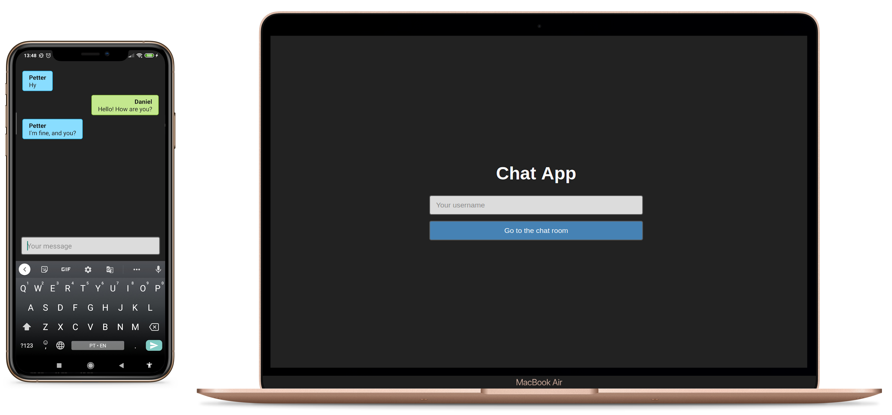

# Chat APP

[SERVER](#server), [WEB](#web) and [MOBILE](#mobile) application. Real time chat app using Node, React and Socket.io 💬📱



## SERVER

### Technologies

- [Node.js](https://nodejs.org/)
- [Express](https://expressjs.com/)
- [Socket.io](https://socket.io/)

## WEB

### Technologies

- [React](https://reactjs.org/)
- [TypeScript](https://www.typescriptlang.org/)
- [Redux](https://redux.js.org/)
- [immer](https://immerjs.github.io/immer/docs/introduction)
- [React Router DOM](https://github.com/ReactTraining/react-router/tree/master/packages/react-router-dom)
- [Styled Components](https://styled-components.com/)
- [Socket.io-client](https://socket.io/docs/client-api/)

## MOBILE

### Technologies

- [React Native](https://reactnative.dev/)
- [TypeScript](https://www.typescriptlang.org/)
- [Redux](https://redux.js.org/)
- [immer](https://immerjs.github.io/immer/docs/introduction)
- [React Navigation](https://reactnavigation.org/)
- [Styled Components](https://styled-components.com/)
- [Socket.io-client](https://socket.io/docs/client-api/)

## GETTING STARTED
### Requirements

- [Node.js](https://nodejs.org/)
- [Yarn](https://yarnpkg.com/) or [npm](https://www.npmjs.com/)
- [git](https://git-scm.com/)
- [React Native development environment](https://reactnative.dev/docs/environment-setup)

#### Clone the project and access the folder

```shell
$ git clone https://github.com/danielmesquitta/chat-app && cd chat-app
```

### Start backend

```shell
# Go to the correct folder
$ cd server
```

Now, inside server, you should create your .env file based on the .env.example, after that you can just run the following commands:

```shell
# Install the dependencies
$ yarn

# Start
$ yarn start
```

### Start web

```shell
# Go to the correct folder
$ cd web
```

Now, inside web, you should create your .env file based on the .env.example (if you want, you can clone your .env file created in the server folder, since they are pretty much the same), after that you can just run the following commands:

```shell
# Install the dependencies
$ yarn

# Start
$ yarn start
```

### Start mobile

```shell
# Go to the correct folder
$ cd mobile
```
Now, inside mobile, you should create your .env file based on the .env.example (if you want, you can clone your .env file created in the server folder, since they are pretty much the same), after that you can just run the following commands:

```shell
# Install the dependencies
$ yarn
```

#### On Android

```shell
# Start
$ yarn android

# If it doesn't start automaticaly, just run the following and reopen the app
$ yarn start
```

#### On IOS

This app was created in a Linux computer, so if you want to run it on a iPhone device you will need to do the linking first

```shell
# Link
$ npx pod install ios

# Start
$ yarn ios

# If it doesn't start automaticaly, just run the following and reopen the app
$ yarn start
```
